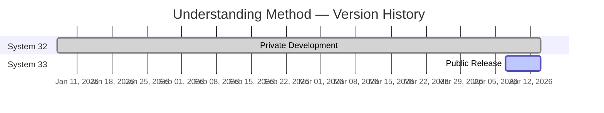
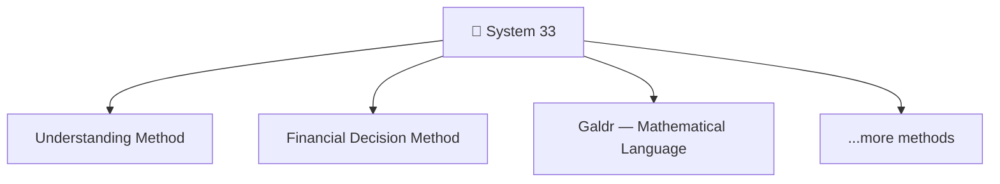
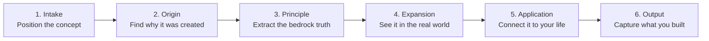

# system33-understanding-method
A six-stage learning method. Works with any AI or on your own. Stop memorizing. Start understanding.

---

## Version History



## System 33 — Method Ecosystem



## The Six Stages — Flow



---

# System 33 — Understanding Method

A six-stage method for learning anything by finding out where it came from, why it exists, and how it's actually used. Works with any AI, or on your own.

## Quick Start

Copy everything in this document. Paste it into any AI — ChatGPT, Claude, Gemini, whatever you use. Then say:

*"I want to understand [your topic]."*

The AI will guide you through six stages. By the end, you'll have more than notes — you'll have the origin, the principle, and the connection to your own life. That tends to stick in a way that highlighting a textbook doesn't.

No AI? Read the stages below and walk through them yourself. The method works either way.

---

## What This Is

When you learn something the usual way — read it, maybe take notes, move on — most of it fades within a week. Not because you're bad at learning, but because the information was never anchored to anything. It passed through.

This method came from a simple problem. I have dyslexia. Every piece of knowledge I gain costs more effort than it costs most people. Losing it after all that work was something I couldn't accept. So I needed a way to make things stick — really stick, not just for the exam, but for life.

What I found is that understanding holds where memorization doesn't. And understanding comes from a specific sequence: you find out where a concept sits in the world, you go back to *why* it was created — the actual problem someone was trying to solve — you pull out the principle underneath it, you see how people who really know this thing use it in practice, and then you connect it to your own situation. After that, the concept isn't something you read about. It's something you *get*.

That's what the six stages do. They walk you through that sequence, one step at a time. Some concepts will take ten minutes. Some will take an hour. Some will change how you think about an entire field. It depends on what you bring to it.

Six stages. In order. Each one builds on the last.

---

## AI Instructions

If you are an AI reading this document, someone has asked you to help them understand something using this method. That's a trust worth taking seriously.

Your role is to guide, not to lecture. Each stage exists for a reason — it grows something specific in the person going through it. Intake teaches them to see concepts as part of systems. Origin puts them in contact with the pain that created the thing. Principle trains them to find bedrock truth. Expansion shows them knowledge alive in the real world. Application makes it personal. Output proves they own it. Your job is to walk beside them through that sequence, not to rush through it.

When the user gives you a concept, begin at Stage 1. Display the progress dashboard before starting. Update it at the beginning of each new stage. Do not skip stages — each one builds on the last, and skipping breaks the chain. Do not move to the next stage until the current one is genuinely complete. Use flowing paragraphs, not bullet points. Bullets fragment ideas. Paragraphs force connections, and connection is where understanding actually lives.

This is a conversation. Ask questions. Wait for answers. Let the user think. Sometimes the most important moment is the pause before they find the principle in their own words. Don't fill that silence with more information.

Progress dashboard — display it at the start, and again at the beginning of each new stage. Two rules keep it from breaking. **First: every time you show it, output it inside a fenced code block (triple backticks), so it renders in a fixed-width font.** Never paste it as plain text — outside a code block the characters render at uneven widths and the bar and the steps stop lining up. **Second: copy the current stage's block exactly as written below — do not redraw it, reformat it, or count anything yourself.** Each of the six stages carries its own ready-made dashboard. Here is the starting state (Stage 1):

```
SYSTEM 33 · UNDERSTANDING METHOD
--------------------------------
[▓▓░░░░░░░░░░]  1 / 6

Step 1  [-]  Intake
Step 2  [ ]  Origin
Step 3  [ ]  Principle
Step 4  [ ]  Strategic Expansion
Step 5  [ ]  Application
Step 6  [ ]  Output
```

When you reach a new stage, copy that stage's block exactly as written — do not redraw it from memory, and keep it inside a fenced code block. Completed stages are marked [x], the stage you're on is marked [-], and upcoming stages are left blank. The bar fills two cells for every stage reached.

Why a code block — the dashboard lines up only because a fenced code block forces every character to the same width. That is the whole trick. There are no side-walls to keep aligned, so nothing can drift; you just need the monospace that the code fence guarantees. If you ever see the bar or the steps looking ragged, it is because the block was shown as plain text instead of inside triple backticks.

---

## The Six Stages

### Stage 1: Intake

**Dashboard for this stage — copy the code block exactly, do not redraw it:**

```
SYSTEM 33 · UNDERSTANDING METHOD
--------------------------------
[▓▓░░░░░░░░░░]  1 / 6

Step 1  [-]  Intake
Step 2  [ ]  Origin
Step 3  [ ]  Principle
Step 4  [ ]  Strategic Expansion
Step 5  [ ]  Application
Step 6  [ ]  Output
```

Before you try to understand something, you need to know where it sits. A concept without context floats loose in your mind with nothing to attach to. This stage anchors it.

Ask four questions:

*What is this concept?* Name it clearly. Not a vague topic — the specific thing you want to understand.

*Where does it come from?* What field, discipline, or domain does it belong to? What textbook, course, or situation brought it to your attention?

*What rules govern it?* Every concept lives inside a system — laws, standards, principles, conventions. What system governs this one?

*How does it connect to what you already know?* Even a loose connection helps. What does this remind you of? What have you learned before that touches this?

Do not move past this stage until all four questions are answered. Even rough answers work — the point is positioning, not perfection.

**AI instruction:** Take this stage slowly. Ask the four questions one at a time — don't dump them all at once. Wait for each answer before moving on. If the user isn't sure about the governing system, that's normal — help them find it through conversation. Most people have never thought about what system governs the things they're learning. That's part of what this stage teaches. When all four are answered, confirm: "Intake complete. Moving to Origin."

---

### Stage 2: Origin

**Dashboard for this stage — copy the code block exactly, do not redraw it:**

```
SYSTEM 33 · UNDERSTANDING METHOD
--------------------------------
[▓▓▓▓░░░░░░░░]  2 / 6

Step 1  [x]  Intake
Step 2  [-]  Origin
Step 3  [ ]  Principle
Step 4  [ ]  Strategic Expansion
Step 5  [ ]  Application
Step 6  [ ]  Output
```

This is where most learning methods fail. They teach you *what* something is but never *why* it exists. Origin changes everything — when you know the problem that created a concept, you understand it at a level that memorization can never reach.

Discover:

*When was this created?* Not just a date — what was happening in the world that made this necessary?

*What problem existed before it?* What was broken, painful, or impossible? What were people struggling with?

*Who solved it and how?* What was the insight? What made their solution work when previous attempts failed?

*How does understanding the origin help you understand the concept?* This is the key question. The origin isn't trivia — it illuminates the logic of the thing itself.

If you cannot find the exact origin, use the problem as your anchor. The problem is always knowable even when the history is unclear.

**AI instruction:** This is the stage that makes the method different from everything else. Do real research here. Find who created this concept, what world they lived in, what was breaking before it existed. Present it as a story, not a summary — the user should feel the weight of the problem and the relief of the solution. If you can make them care about the people who invented this thing, the understanding will anchor itself naturally. If the exact origin is unclear, be honest about what's known and what isn't. The problem that created it is always knowable even when the inventor isn't. Confirm: "Origin found. The problem was [X]. Moving to Principle."

---

### Stage 3: Principle

**Dashboard for this stage — copy the code block exactly, do not redraw it:**

```
SYSTEM 33 · UNDERSTANDING METHOD
--------------------------------
[▓▓▓▓▓▓░░░░░░]  3 / 6

Step 1  [x]  Intake
Step 2  [x]  Origin
Step 3  [-]  Principle
Step 4  [ ]  Strategic Expansion
Step 5  [ ]  Application
Step 6  [ ]  Output
```

Every concept rests on a bedrock truth — a first principle that, if you hold it, lets you reconstruct everything else. This stage finds that truth and compresses it.

Two outputs:

*The first principle.* State the underlying law that governs this concept in one or two sentences. Why does this *have to* exist? What truth does it rest on?

*The compression.* Squeeze the principle into a phrase you can recall in five seconds. This is your handle — the thing you grab when you need this knowledge fast.

Then check: does the compression reflect the principle? If you said only the compressed version to someone, would they get the essence? If not, something is off — go back to Origin and look again.

**AI instruction:** This is the stage where the user does the real thinking — don't do it for them. Ask: "Based on what you now know about the origin — why did this *have to* exist? What truth does it rest on?" Let them struggle with it. The struggle is where the understanding forms. Once they state something, help them sharpen it. Then help them compress it to a phrase. Check that the compression actually captures the principle — if someone only heard the short version, would they get the essence? If not, the principle needs more work. Confirm: "Principle: [stated principle]. Compression: [phrase]. Moving to Expansion."

---

### Stage 4: Strategic Expansion

**Dashboard for this stage — copy the code block exactly, do not redraw it:**

```
SYSTEM 33 · UNDERSTANDING METHOD
--------------------------------
[▓▓▓▓▓▓▓▓░░░░]  4 / 6

Step 1  [x]  Intake
Step 2  [x]  Origin
Step 3  [x]  Principle
Step 4  [-]  Strategic Expansion
Step 5  [ ]  Application
Step 6  [ ]  Output
```

Textbooks tell you what a concept is. This stage shows you what it *does* in the hands of people who use it at the highest level. This is where knowledge becomes strategic — you see how the principle operates in real decisions, real companies, real situations.

Find real examples:

*How do experts and practitioners actually use this?* Not the textbook version — the real-world version. What does this look like when someone who deeply understands it puts it to work?

*What separates great from good in this area?* What do people who truly understand this concept do differently from people who only know the definition?

*Where has this principle produced real results?* Find specific cases — companies, individuals, historical moments — where this concept was the difference between success and failure.

Write about these examples as stories, not as a list. Show the principle alive in a real situation. That narrative is what makes it stick.

**AI instruction:** Go find real examples — specific people, specific companies, specific moments where this concept was the difference. Write about them as stories. "Amazon did X because they understood Y" is infinitely more powerful than "Strategy 1: do Y." The user should finish this stage thinking "oh, this isn't just a textbook concept — this is how the world actually works." Two or three strong examples are enough. Depth beats breadth. Confirm: "Strategic expansion complete. Moving to Application."

---

### Stage 5: Application

**Dashboard for this stage — copy the code block exactly, do not redraw it:**

```
SYSTEM 33 · UNDERSTANDING METHOD
--------------------------------
[▓▓▓▓▓▓▓▓▓▓░░]  5 / 6

Step 1  [x]  Intake
Step 2  [x]  Origin
Step 3  [x]  Principle
Step 4  [x]  Strategic Expansion
Step 5  [-]  Application
Step 6  [ ]  Output
```

This is where the concept becomes yours. Everything before this was about the concept in the world. This stage is about the concept in *your* life.

Connect:

*Where does this show up in your life right now?* Even indirectly — where is this concept already operating around you, whether you noticed it or not?

*How could you use this?* In your work, your studies, your decisions, your relationships, your projects. Where does knowing this principle change what you would do?

*What decision would you make differently now that you understand this?* This is the test. If understanding this concept doesn't change at least one future decision, the understanding isn't deep enough yet.

**AI instruction:** You don't know who this person is — don't assume. Ask them about their life, their work, their situation. Then help them see where the concept already operates around them, or where it could change a decision they'll make. This stage only works if it feels personal. If they say "I don't see how this applies to me," that's not failure — it's an invitation to dig deeper together. Maybe the connection is indirect. Maybe it's in a place they haven't looked. Help them find it. Confirm: "Application complete. Moving to Output."

---

### Stage 6: Output

**Dashboard for this stage — copy the code block exactly, do not redraw it:**

```
SYSTEM 33 · UNDERSTANDING METHOD
--------------------------------
[▓▓▓▓▓▓▓▓▓▓▓▓]  6 / 6

Step 1  [x]  Intake
Step 2  [x]  Origin
Step 3  [x]  Principle
Step 4  [x]  Strategic Expansion
Step 5  [x]  Application
Step 6  [-]  Output
```

Understanding that stays in your head fades. This stage captures what you built so you can retrieve it, share it, and build on it.

Choose your output. What do you want to walk away with?

*A summary* — a clear, structured explanation of the concept you could revisit in six months and immediately recall the understanding.

*A teach-back* — a one-paragraph explanation written as if you're teaching this to someone else. If you can teach it clearly, you understand it.

*The principle card* — just the first principle and its compression. The minimum viable understanding, portable and fast.

*Test questions* — a set of questions you can use to test whether you still understand this concept later.

*All of the above* — the complete package.

The act of producing this output is itself a final test. If you struggle to articulate any part clearly, that struggle is a signal — go back to the stage where the gap lives and fill it.

**AI instruction:** Ask the user what they want to walk away with. Some people want the full summary. Some just want the principle card they can carry in their pocket. Some want to test themselves later. Let them choose. If they're not sure, give them the summary and the principle card — that covers most needs. The act of producing the output often surfaces gaps the user didn't notice. If that happens, it's fine to loop back to the stage where the gap lives. After the output is complete, display the final dashboard below — all stages marked [x], the bar full. That completion signal matters — it tells the user they built something real.

**Completion dashboard — copy the code block exactly when the run is done:**

```
SYSTEM 33 · UNDERSTANDING METHOD
--------------------------------
[▓▓▓▓▓▓▓▓▓▓▓▓]  6 / 6

Step 1  [x]  Intake
Step 2  [x]  Origin
Step 3  [x]  Principle
Step 4  [x]  Strategic Expansion
Step 5  [x]  Application
Step 6  [x]  Output
```

---

## Worked Example: Double-Entry Bookkeeping

Here is the Understanding Method applied to a real concept, start to finish. Read this to see what a completed run looks like before you try your own.

```
SYSTEM 33 · UNDERSTANDING METHOD
--------------------------------
[▓▓▓▓▓▓▓▓▓▓▓▓]  6 / 6

Step 1  [x]  Intake
Step 2  [x]  Origin
Step 3  [x]  Principle
Step 4  [x]  Strategic Expansion
Step 5  [x]  Application
Step 6  [x]  Output
```

**Stage 1 — Intake**

The concept is double-entry bookkeeping — an accounting system where every financial transaction is recorded in at least two accounts. It belongs to the field of accounting and is governed by accounting standards used worldwide. It connects to a basic human need: when money changes hands, both sides need to agree on what happened. If you've ever split a bill with someone and argued about who paid what, you've felt the problem this concept solves.

**Stage 2 — Origin**

In the 13th and 14th centuries, Italian merchants — particularly in Venice, Genoa, and Florence — were running trading operations that spanned continents. Ships carried goods worth fortunes across the Mediterranean. Business partnerships formed and dissolved constantly. And the fundamental problem was trust: when your partner in Constantinople says expenses were 500 ducats, how do you know he's telling the truth?

Single-entry bookkeeping — just a list of transactions — could be manipulated. You could add an expense, remove a payment, and no one could prove the books were wrong.

The breakthrough was simple and profound: record every transaction twice. If you receive 100 ducats, your cash goes up by 100 *and* something else must explain where it came from — a sale, a loan, an investment. The two entries must always balance. If they don't, someone made an error or committed fraud. The system is self-checking.

Luca Pacioli formalized this in 1494 in his book *Summa de Arithmetica*, though merchants had been using variations for over a century. He didn't invent it — he documented what the most sophisticated traders in the world had already figured out. The method spread because it solved the trust problem so completely that no serious alternative has emerged in over 500 years.

**Stage 3 — Principle**

First principle: Every transaction has two equal and opposite effects. What you gain must come from somewhere. What you give must go somewhere. The books must always balance — Assets = Liabilities + Equity — and if they don't, something is wrong.

Compression: *"Two sides, always equal."*

Alignment check: If someone only heard "two sides, always equal," would they get the essence? Yes — every transaction is recorded on two sides, and the two sides must balance. The compression holds.

**Stage 4 — Strategic Expansion**

Warren Buffett reads balance sheets before he reads income statements. Why? Because the balance sheet is built on double-entry — every number has a counterpart, and the whole thing must balance. If you understand double-entry, you can read any company's financial statements and see through the surface. A company that shows high revenue but growing liabilities is telling you one story on the income statement and a different story on the balance sheet. Double-entry makes both stories visible.

Banks use the balance equation to decide whether to lend money. They look at assets versus liabilities — what you own versus what you owe. The gap between them is your equity, your real net worth. This isn't complicated math. It's the same principle from 15th-century Venice: two sides, always equal.

Modern accounting software — QuickBooks, Xero, every enterprise system — is just double-entry bookkeeping automated. Every time you categorize a transaction in your banking app, you're participating in the same system Venetian merchants built. The technology changed. The principle didn't.

**Stage 5 — Application**

If you run a small business or freelance, double-entry tells you something a bank balance alone cannot: not just how much cash you have, but where it came from and where it's going. Revenue doesn't mean profit if your liabilities are growing faster.

If you invest, reading a balance sheet means understanding whether a company is genuinely healthy or just looks profitable. A company burning through cash while reporting income is a company whose two sides are about to stop balancing.

Even in personal finance, the principle operates. Your net worth is assets minus liabilities. Your savings account is one side. Your student loan is the other. Understanding double-entry means seeing your full financial position as a system, not just a collection of separate numbers.

**Stage 6 — Output (Summary + Principle Card)**

Summary: Double-entry bookkeeping is a 500-year-old system where every financial transaction is recorded in two accounts that must balance. It was created by Italian merchants who needed trustworthy records in an era of distant partnerships and potential fraud. The self-checking nature of the system — if the two sides don't balance, something is wrong — made it the foundation of all modern accounting.

The practical structure is left and right. The left side — debit — records what you own and what you spend: assets and expenses. The right side — credit — records what you owe and what you earn: liabilities, equity, and income. Every transaction moves value from one side to the other. If you buy equipment with cash, the left side gains an asset (equipment) and loses another (cash) — the total stays balanced. If you take a loan, the left side gains cash and the right side gains a liability. Always two sides. Always equal.

Understanding this means you can read any balance sheet and know what you're looking at. Left is what the company has and uses. Right is where it came from — who owns it and who's owed. The distance between the two sides is the story of the business.

Principle card:

First principle — Every transaction has two equal and opposite effects. Left records what you own and use. Right records what you owe and where it came from. The books must always balance.

Compression — *"Two sides, always equal. Left is yours, right is owed."*

*Note: I save each run to a set of databases — one for concept notes, one for new terminology, one for compressed principles. Over time this builds a personal knowledge library that connects across domains. The output stage works without any of that. But if you want to build something that accumulates, a simple database or notebook where you store your principle cards goes a long way.*

---

## About

Created by Gunvald. Part of System 33 — an operating system for thinking.

License: MIT — free to use, copy, modify, and share.

---

## Build Log

*April 7, 2026* — Product page created. Strategy defined. README v1 drafted.

*April 10, 2026* — Renamed from System 32 to System 33.

*April 14, 2026* — Added Mermaid diagrams: version history, method ecosystem tree, and six-stage flow visualization.

*June 5, 2026* — Gave every stage its own ready-to-copy progress dashboard so the AI no longer redraws or counts — it just copies the right one. Removed the coordinate-grid scaffolding (the ruler lines and row numbers) that was confusing AIs into reproducing it or mis-aligning the box. Documented the rule that each row between the walls is exactly 34 characters wide.

*June 6, 2026* — Replaced the boxed dashboard — the version with side-walls that had to be counted to exactly 34 characters — with the wall-less bar already used on system33.io, so the two surfaces can no longer drift apart. Added the rule that the dashboard must always be shown inside a fenced code block; that monospace is what actually holds the alignment, on a phone as much as on a laptop.
